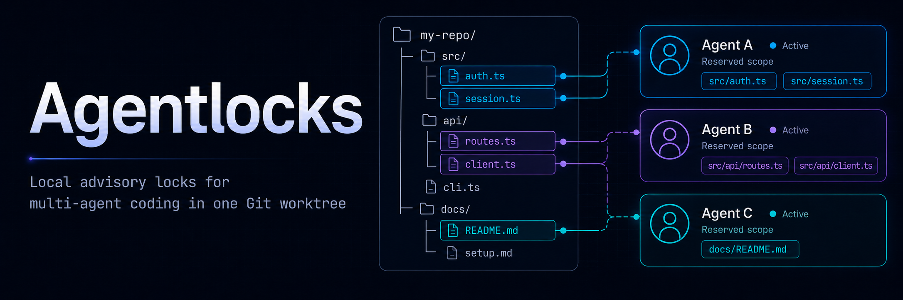

# Agentlocks

**Advisory file locks that let multiple AI coding agents share one Git worktree without clobbering each other.**

<p align="center">
  
</p>

<p align="center">
  <a href="https://www.npmjs.com/package/agentlocks"></a>
  = 1.2">
  
  
  
</p>

Run two coding agents in the same repository (or one agent with subagents) and they start
tripping over each other: two edit the same file and silently overwrite work, a "working on
`auth.ts`" note goes stale and never clears, and two `git add` runs race for the same index.
**Agentlocks turns those collision points into explicit, scriptable leases.**

It's **agent-native**: identity comes from the harness, so there are no ids to manage; every
command speaks JSON; errors name the exact fix; and the contract tells the agent what to run
next. No daemon, no database, no hosted service. Just files under `.agentlocks/locks/`.

## Install

```bash
npm install -g agentlocks      # or: bun install -g agentlocks
agentlocks --help
```

Bun `>=1.2` must be on `PATH` at runtime; the executable runs through `#!/usr/bin/env bun`,
even when installed through npm. Then run `agentlocks init` once inside each repo you want to
coordinate.

## See it in 20 seconds

```bash
# Inside Codex or Claude Code, the agent's identity is detected automatically.
lock=$(agentlocks acquire src/auth.ts --reason "refactor login" --id-only)

# ... the agent edits src/auth.ts, runs tests ...

agentlocks release "$lock" --id-only
```

A second agent that tries to `acquire src/auth.ts` while that lease is held gets a clean
conflict: the blocking owner, its reason, and the exact command to run next, instead of a
silent overwrite.

## Genuinely agent-native

Most CLIs are designed for humans and merely tolerated by agents. Agentlocks inverts that. Every
surface is held to an agent-ergonomics bar, and you can verify each claim yourself:

| What an agent needs | What Agentlocks gives it | Try it |
| --- | --- | --- |
| **Zero-config identity** | The harness supplies the agent id; you never pass `--agent-id` | `agentlocks identify --json` |
| **Machine-readable output** | `--json` / `--id-only` on every data surface; stdout is data, stderr is diagnostics | `agentlocks status --json` |
| **A self-describing contract** | Every command, flag, exit code, and follow-up, in one payload | `agentlocks capabilities --json` |
| **In-tool docs** | A paste-ready agent handbook, no external doc lookup needed | `agentlocks robot-docs guide` |
| **Errors that teach** | A wrong flag gets a "did you mean" plus the exact corrected command | `agentlocks status --jason` |
| **Next-step breadcrumbs** | The contract names the next command for every verb; conflicts and errors print a `next:` line | `agentlocks capabilities --json` |

A typo doesn't dead-end the agent. It teaches:

```text
$ agentlocks status --jason
agentlocks error: error: unknown option '--jason'
(Did you mean --json?)
next: agentlocks status --json
```

Identity just works, with no setup and no flags:

```text
$ agentlocks identify --json
{"kind":"identified","agent_id":"claude-code:0fd188d5-…","source":"harness:claude-code:CLAUDE_CODE_SESSION_ID","harness":"claude-code"}
```

Agentlocks even brings its own harness integration: `agentlocks init --harness claude-code`
installs a Claude Code `PreToolUse` hook (and `--harness codex` the Codex equivalent) that runs
an advisory `git verify` before a `git commit` tool-call, surfacing staged-but-unlocked paths
without ever blocking the commit or touching your git config.

## What it coordinates

Concurrent repository work fails in three predictable places. Agentlocks makes each one explicit,
owned, and parseable:

| Collision point | Agentlocks behavior | Proof surface |
| --- | --- | --- |
| Two workers edit the same file | `acquire`, `expand`, `refresh`, `release` over repo-relative paths and globs | `agentlocks capabilities --json` |
| A stale "I'm on this" note never clears | TTL leases, liveness classification, `prune --dry-run` then `prune` | `agentlocks prune --dry-run --json` |
| Two workers race the shared Git index | `git begin` takes the synthetic `@git/index` lock; `git end` releases it | `src/locks/types.ts`, `tests/locks.test.ts` |

Agentlocks is **advisory**: it coordinates agents that agree to use it. It does not stop an
editor, shell command, or Git operation that ignores the protocol, which is also why it needs
no daemon, no privileges, and no lock-holding background process.

## Why Agentlocks

| Approach | Works well for | Where it falls short for shared worktrees |
| --- | --- | --- |
| Manual notes in chat or issues | Informal coordination and intent | No lease, no owner check, no parseable status, easy to forget before staging |
| Shell scripts | Local conventions around one repo | Usually miss conflict semantics, stale sessions, JSON contracts, and Git-index locking |
| `flock` | Process-level critical sections on one machine | Not a repo resource registry; no path/glob inventory, owner metadata, install guidance, or agent docs |
| Git-native hooks (`pre-commit`) | Commit-time policy checks | Too late to prevent overlapping edits; hooks do not coordinate `git add` across workers, and a single `core.hooksPath` collides with husky/lefthook |
| Hosted lock service | Cross-machine coordination | Requires a service, credentials, network access, and operational ownership |
| Agentlocks | Local agents in one repository worktree | Advisory only; participants opt in. Ships `git verify` plus an opt-out PreToolUse backstop (Claude Code + Codex) that runs it *before* a `git commit` tool-call; installs no git hook and never reconfigures your git |

## Quick Demo

This demo runs inside Codex or Claude Code. The active harness identity is detected
automatically, including Claude Code subagents when `agentlocks init --harness claude-code` has
installed the project hook.

```bash
HOST="$(mktemp -d)"
cd "$HOST"
git init -q

printf 'console.log("hello")\n' > app.ts
printf '# Demo host repo\n' > AGENTS.md
printf '{"scripts":{}}\n' > package.json

# Expected to exit 1 when init drift is found; it does not write files.
agentlocks init --check --json || true
agentlocks init

agentlocks identify --json
file_lock="$(agentlocks acquire app.ts --reason "edit app" --id-only)"
agentlocks expand --lock "$file_lock" README.md --id-only
agentlocks refresh "$file_lock" --id-only

git_lock="$(agentlocks git begin --refresh-lock "$file_lock" --reason "commit demo" --id-only)"
agentlocks status --json
agentlocks git end "$git_lock" --release-lock "$file_lock" --id-only

agentlocks prune --dry-run --json
agentlocks doctor --json
```

Expected shape:

```text
identify shows a harness source such as CODEX_THREAD_ID or AGENTLOCKS_HARNESS_AGENT_ID.
status shows two locks while the file lock and @git/index lock are held.
git end prints the released git lock id and file lock id.
prune --dry-run reports pruned_count 0 in a fresh repo.
doctor reports ok true after init completes.
```

## Host Setup

`agentlocks init` is idempotent and writes the host-repo support files. Run it once per repo;
add `--harness claude-code` (or `--harness codex`) to also install the PreToolUse hooks.

```bash
agentlocks init --check --json || true     # preview changes; exits 1 on drift, writes nothing
agentlocks init

# Claude Code: also install the .claude PreToolUse hooks.
agentlocks init --check --harness claude-code --json || true
agentlocks init --harness claude-code
```

`init` can create or update:

| Path | Behavior |
| --- | --- |
| `.agentlocks/locks/active/` | Local active lock records |
| `agentlocks.config.ts` | Default config when missing; existing config is preserved |
| `AGENTS.md` | Marked Agentlocks instructions block (read by Codex and Claude Code) |
| `.claude/settings.json` | Adds a Claude Code `PreToolUse` hook when `--harness claude-code` is used |
| `.claude/hooks/agentlocks-agent-env.mjs` | Per-Bash-call agent id hook; **by default also runs `git verify` before a `git commit` tool-call** (one script, advisory; pass `--no-commit-hook` for the id-injection-only body) |
| `.codex/hooks.json` + `.codex/hooks/agentlocks-git-verify.mjs` | Codex `PreToolUse` commit-hook backstop when `--harness codex` is used (project-local hooks need trust before they run) |
| `.gitignore` | Adds `.agentlocks/` |
| `package.json` | Adds missing recommended scripts when a package file exists |

The commit-hook backstop is advisory: it surfaces staged-but-unlocked paths before a `git commit`
tool-call and **never blocks the commit**. It is installed by default; `agentlocks init
--no-commit-hook` keeps the original id-injection-only Claude hook and skips the Codex hook.

Recommended host scripts, inserted when absent:

```json
{
  "scripts": {
    "agentlocks": "agentlocks",
    "agentlocks:status": "agentlocks status",
    "agentlocks:init": "agentlocks init"
  }
}
```

## Quick Start

The steps below assume the global install above and a supported agent harness. Codex and Claude
Code identity is automatic.

1. Initialize the host repo (writes the `AGENTS.md` instructions block).

   ```bash
   agentlocks init --check --json || true
   agentlocks init

   # Claude Code: also install the .claude PreToolUse hooks.
   agentlocks init --check --harness claude-code --json || true
   agentlocks init --harness claude-code
   ```

2. Inspect the detected agent id.

   ```bash
   agentlocks identify --json
   ```

3. Acquire the narrowest lock before editing.

   ```bash
   agentlocks acquire src/index.ts tests/cli.test.ts --reason "change CLI dispatch" --id-only
   ```

4. Expand before touching another file.

   ```bash
   agentlocks expand --lock <lock_id> src/config.ts --id-only
   ```

5. Refresh before long edit batches, after tests, and before staging.

   ```bash
   agentlocks refresh <lock_id> --id-only
   ```

6. Coordinate the shared Git index. `git begin --id-only` prints two lines: the git lock id, then a
   fence token that `git end` re-checks (it aborts with exit 3 if the lease was reclaimed mid-commit).

   ```bash
   { read git_lock; read git_token; } < <(agentlocks git begin --refresh-lock <lock_id> --reason "commit Agentlocks change" --id-only)
   git add <locked_paths>
   git commit
   agentlocks git end "$git_lock" --git-token "$git_token" --release-lock <lock_id> --id-only
   ```

   Or let `agentlocks commit` do all of it (lock, stage, commit, fence, release) in one command.

7. Before a *raw* `git commit`, sanity-check coverage (advisory; never blocks):

   ```bash
   agentlocks git verify --json     # lists any staged-but-unlocked paths
   ```

   This is what the opt-out PreToolUse commit-hook backstop runs automatically. If you ever lose
   your lock ids (e.g. after context compaction), recover with `agentlocks status --mine` and
   `agentlocks release --mine` / `agentlocks refresh --mine`.

## Command Reference

`agentlocks capabilities --json` is the source of truth for command metadata, flags, exit codes,
default TTLs, agent identity detection, and next commands.

| Command | Purpose | Key flags | Output notes |
| --- | --- | --- | --- |
| `acquire [paths...]` | Acquire locks for exact repo-relative paths or globs | `--glob`, `--reason`, `--ttl-ms`, `--reclaim`, `--agent-id`, `--json`, `--id-only`, `--verbose` | `--reason` and at least one path or glob are required; `--reclaim` takes over conflicts that are all reclaimable |
| `expand --lock <id> [paths...]` | Add paths or globs to an existing lock atomically | `--lock`, `--glob`, `--ttl-ms`, `--agent-id`, `--json`, `--id-only`, `--verbose` | Requires the owning agent id |
| `refresh [locks...]` | Extend held lock leases, or all of yours with `--mine` | `--lock`, `--mine`, `--ttl-ms`, `--agent-id`, `--json`, `--id-only`, `--verbose` | Positional ids and repeatable `--lock` are merged; `--mine` needs a stable identity |
| `release [locks...]` | Release held locks, or all of yours with `--mine` | `--lock`, `--mine`, `--agent-id`, `--json`, `--id-only`, `--verbose` | `--mine` drops every lock you hold (no ids needed); rejects an unstable identity with exit 2 |
| `status [paths...]` | List active locks, filtered by resources or `--mine` | `--glob`, `--mine`, `--json`, `--id-only`, `--verbose` | `--mine` shows only your locks; compact JSON includes each lock's status |
| `board [paths...]` | Who/What/Where overview grouped by agent, with each lease's state | `--glob`, `--mine`, `--json`, `--id-only`, `--verbose` | Read-only and mutex-free; run it before claiming to pick a free area |
| `prune` | Remove reclaimable expired locks | `--dry-run`, `--json`, `--id-only`, `--verbose` | Use `--dry-run` before deleting |
| `identify` | Show detected agent identity | `--agent-id`, `--json`, `--verbose` | `--id-only` is rejected; use `identify --json` |
| `git begin` | Acquire the synthetic `@git/index` lock | `--reason`, `--refresh-lock`, `--ttl-ms`, `--agent-id`, `--json`, `--id-only`, `--verbose` | Can refresh held file locks first; `--id-only` prints two lines: the lock id, then a fence token |
| `git end [locks...]` | Release the synthetic Git-index lock | `--lock`, `--release-lock`, `--git-token`, `--agent-id`, `--json`, `--id-only`, `--verbose` | `--git-token` re-checks the fence before releasing; can release file locks after |
| `git verify` | Advisory check: are staged paths covered by a held lock? | `--staged`, `--include-unstaged`, `--pathspec`, `--pathspec-mode`, `--json`, `--verbose` | Read-only, never blocks, always exits 0; the engine behind the commit-hook backstop |
| `run [paths...] -- <cmd>` | Acquire locks, run the command after `--`, then release | `--glob`, `--reason`, `--ttl-ms`, `--agent-id` | The wrapped command runs outside the registry mutex; exit code is the command's |
| `edit [paths...] -- <cmd>` | Acquire locks, run the command after `--`, and keep the lock | `--glob`, `--reason`, `--ttl-ms`, `--agent-id` | Prints the lock id so you can refresh or release it across turns |
| `commit [paths...]` | Lock the paths and the Git index, stage and commit only those paths, then release | `--glob`, `--reason`, `--message`, `--keep`, `--ttl-ms`, `--agent-id` | Pathspec-scoped `git add`/`git commit`; `--keep` retains the file lock |
| `init` | Initialize or check host support files | `--check`, `--harness auto\|codex\|claude-code`, `--no-commit-hook`, `--json`, `--verbose` | Installs the PreToolUse commit-hook backstop by default; `--no-commit-hook` skips it; `--check` exits 1 on drift |
| `capabilities` | Print the CLI contract | `--json` | Compact single-line JSON |
| `robot-docs guide` | Print an in-tool agent workflow guide | none | Human text, deterministic golden-tested output |
| `doctor` | Run read-only health checks | `--json`, `--verbose` | Exits 1 when warnings or errors are present |

Do not pass `--agent-id` in normal Codex or Claude Code use. That flag exists for unsupported
harness integrations and recovery from outside the original harness agent.

### Exit Codes

| Code | Name | Meaning |
| --- | --- | --- |
| 0 | `success` | Command completed successfully |
| 1 | `cli_or_check_error` | CLI parse error, init check drift, or `doctor` warning/error result |
| 2 | `lock_usage_error` | Invalid lock input, missing lock id, or missing lock resource |
| 3 | `lock_conflict` | Lock conflict or ownership failure |

When `--json` is present, parse and runtime errors use compact payloads shaped like:

```json
{"ok":false,"code":"commander.unknownOption","message":"error: unknown option '--jason'","details":{"suggestion":{"replace":"--jason","with":"--json","command":"agentlocks status --json"}}}
```

## Configuration

Host repositories may add `agentlocks.config.ts` at the repository root. Defaults stay generic.

```ts
import type { AgentlocksConfig } from "agentlocks";

export default {
  // Display name used in generated instruction text. Defaults to the repo directory name.
  projectName: "example",

  // Local lock state root. Active records live under active/, events under events.jsonl,
  // and registry serialization uses a .mutex directory.
  lockRoot: ".agentlocks/locks",

  command: {
    // Command rendered into the generated AGENTS.md instructions.
    executable: "agentlocks",

    // Use prefix instead when the command should render through a project script or wrapper.
    // prefix: ["env", "AGENTLOCKS_PROFILE=team"],

    // Or render through a package script.
    // packageRunner: "bun",
    // packageScript: "agentlocks",
  },

  defaults: {
    // Default lease length for new locks and refreshes.
    ttlMs: 600_000,

    // Upper bound accepted by --ttl-ms.
    maxTtlMs: 1_800_000,

    // Grace after expiry when liveness cannot be proven. Short by default so a
    // dead, un-probeable lock reclaims soon after its lease lapses. May be 0.
    unknownLivenessGraceMs: 90_000,

    // When true, acquire takes over a conflict whose locks are all reclaimable
    // in one command. The `acquire --reclaim` flag always does this regardless.
    autoReclaimOnConflict: false,

    // When true, an agent's own acquire/expand/refresh extends its other held
    // leases, so a busy agent rarely needs a dedicated refresh.
    keepAliveOnMutation: true,
  },

  owner: {
    // Fallback lookup for unsupported harness integrations.
    // Codex and Claude Code use harness detection automatically.
    envKeys: ["AGENTLOCKS_AGENT_ID"],

    // Runtime harnesses checked first.
    harnesses: ["codex", "claude-code"],

    // Generic fallback prefix when no harness, explicit id, or env id is available.
    fallbackPrefix: "agentlocks",
  },

  liveness: {
    // "auto" (default) probes by the owner's detected harness: the Codex
    // session index or the Claude Code session transcript, falling back to the
    // grace window for un-probeable owners. "unknown" disables probing;
    // "codex" or "claude-code" force a single adapter.
    adapter: "auto",
  },

  agents: {
    enabled: true,
    heading: "Agentlocks coordination",
  },

  init: {
    updateAgents: true,
    updateGitignore: true,
    updatePackageScripts: true,
  },
} satisfies AgentlocksConfig;
```

Config discovery starts at the current working directory, walks up to the nearest `.git`, then
loads `agentlocks.config.ts` if present. Without a config file, Agentlocks uses the defaults above.

## Library API

The package export is defined in `package.json` as `src/index.ts`. In Bun/TypeScript projects, use
the package directly:

```ts
import {
  FileLockRegistry,
  defineAgentlocksConfig,
  executeLockCommand,
  loadAgentlocksConfig,
  runInit,
} from "agentlocks";

const config = defineAgentlocksConfig({
  lockRoot: ".agentlocks/locks",
});

await runInit({ root: process.cwd(), check: true });

const result = await executeLockCommand({
  name: "acquire",
  paths: ["src/index.ts"],
  globs: [],
  reason: "edit library entry",
  ttlMs: null,
  agentId: "docs-example",
  json: true,
  idOnly: false,
});

console.log(result.exitCode, result.json);

const registry = new FileLockRegistry({ cwd: process.cwd() });
console.log(registry.identify("docs-example").owner?.agentId);

await loadAgentlocksConfig();
console.log(config.lockRoot);
```

Other exported helpers include config resolution, init rendering, resource matching, resource
normalization, session detection, liveness probes, lock result rendering, and lock types.

## Architecture

```text
bin/agentlocks.ts
  -> src/index.ts
    -> cli/main
      -> Commander parser
        -> lock command handlers
          -> loadAgentlocksConfig
          -> FileLockRegistry
            -> normalize paths/globs/@git/index
            -> .agentlocks/locks/.mutex
            -> .agentlocks/locks/active/<lock_id>.json
            -> .agentlocks/locks/events.jsonl
        -> init handler
          -> agentlocks.config.ts
          -> AGENTS.md marked block
          -> .gitignore
          -> package.json scripts
        -> capabilities / robot-docs / doctor
          -> stdout text or compact JSON
```

The registry writes lock records atomically through a temporary file and rename. Mutating registry
operations are serialized with a directory mutex that Agentlocks can reclaim after it becomes stale.

## Safety Model

Agentlocks is built for cooperative local coordination.

| Guarantee | Details |
| --- | --- |
| Advisory locking | Agentlocks reports and records conflicts; it does not patch editors, shells, or Git to enforce them |
| Owner-only changes | `expand`, `refresh`, and `release` require the agent id recorded on the lock |
| Short leases | Default TTL is 10 minutes; maximum default is 30 minutes |
| Stale recovery | Expired locks are classified by liveness and become reclaimable after the configured unknown-liveness grace |
| Safe inspection | `init --check --json`, `prune --dry-run --json`, `status --json`, `capabilities --json`, and `doctor --json` are the inspection surfaces |
| Git-index coordination | `git begin` locks only the synthetic `@git/index` resource; file locks are separate and should still cover staged paths |

Agentlocks does not provide a hosted coordinator, cross-machine consensus, authentication, encryption,
or a migration layer for old lock schemas. The lock record schema is current-version only.

## Troubleshooting

| Symptom | Meaning | Next command |
| --- | --- | --- |
| `lock conflict: <path>` | Another active or unreclaimable lock overlaps your requested resource | `agentlocks status <path> --json` |
| Conflict JSON has `suggested_action: "prune_then_retry"` | All overlapping locks are reclaimable | `agentlocks prune --dry-run --json`, then `agentlocks prune` |
| `Lock <id> is owned by <owner>; current owner is <caller>.` | The current agent id differs from the id that created the lock | Continue from the same harness agent, or use `--agent-id <owner>` for unsupported harness recovery |
| `At least one lock id is required for refresh.` | `refresh`, `release`, or `git end` needs a lock id | `agentlocks status --id-only` |
| `Lock path must be repo-relative` | Absolute paths are rejected | `agentlocks acquire path/from/repo/root --reason "<intent>"` |
| `Lock TTL must be <= 1800000.` | The requested lease exceeds the configured maximum | `agentlocks refresh <lock_id> --ttl-ms 600000` |
| `init --check --json` exits 1 | Init drift was found; no files were written | Review JSON changes, then run `agentlocks init` |
| `doctor --json` reports init drift | Support files are missing or stale | `agentlocks init --check --json` |
| Unknown flag or command prints `next:` | Agentlocks found a close match | Run the exact `next:` command |

## Limitations

- Agentlocks is pre-release, and the CLI requires Bun at runtime.
- There is no checked-in GitHub Actions workflow, so this README does not show a CI badge.
- Agentlocks coordinates one local worktree through files under `.agentlocks/locks`; it is not a
  networked lock server.
- Advisory locks work only when participants use Agentlocks before editing and staging.
- Liveness defaults to the `auto` adapter, which probes the owner's harness (the Codex session
  index or the Claude Code session transcript) and falls back to a short grace window when the
  owner cannot be probed.
- `init` writes a generic instruction block. It does not add prompt-optimization behavior,
  repository-specific defaults, or command aliases.
- There are no compatibility layers, deprecated command names, or migration tools for previous
  internal layouts or schemas.
- `agentlocks --version` is not implemented; use `agentlocks capabilities --json` for the current
  package version.

## FAQ

### Is this only for agents?

Agentlocks is agent-native. A person can run the same commands for recovery or local debugging, but
the normal workflow assumes Codex, Claude Code, or another coding harness supplies a stable agent
id.

### How should agents identify themselves?

They normally should not. Agentlocks checks supported harness identity first. Claude Code hooks pass
`AGENTLOCKS_HARNESS_AGENT_ID`; Codex uses `CODEX_THREAD_ID`; Claude Code falls back to
`CLAUDE_CODE_SESSION_ID` when the hook is absent. `--agent-id` and `AGENTLOCKS_AGENT_ID` are only for
unsupported harness integrations or recovery from outside the original harness agent. Without any
stable source, Agentlocks falls back to a process-scoped id.

### How do users know when to update?

Interactive Agentlocks commands check npm at most once per day and print a stderr notice when a
newer version is available:

```text
New Agentlocks version available: 0.1.1 -> 0.1.2
Update with: bun update -g --latest agentlocks
npm users: npm install -g agentlocks@latest
```

The update check is skipped for `--json`, `--id-only`, CI, and non-TTY runs so automation output
stays parseable. Set `AGENTLOCKS_DISABLE_UPDATE_CHECK=1` to disable it completely.

### What happens in CI?

Use `agentlocks status --json`, `agentlocks capabilities --json`, and `agentlocks doctor --json` for
read-only checks. Mutating lock commands can work in CI, but Agentlocks is primarily designed for
interactive shared worktrees.

### Does Agentlocks replace Git branches?

No. It coordinates local edits and shared index access inside a worktree. Branch strategy stays
outside Agentlocks.

### Does `@git/index` lock every file?

No. `@git/index` only coordinates staging and commit access. Acquire normal file or glob locks for
the paths you intend to edit and stage.

### How does stale lock cleanup work?

Locks expire by TTL. If liveness is dead, or unknown beyond the configured grace period, `prune`
can remove the record. Use `prune --dry-run --json` first.

### Can I use it in a monorepo?

Yes, if every participant agrees on the same repository root and lock root. Use repo-relative paths
and configure `lockRoot` if the default `.agentlocks/locks` is not where you want local state.

### Is the lock state safe to commit?

No. `init` adds `.agentlocks/` to `.gitignore`. The lock state is local coordination data.

## Development

```bash
bun install --frozen-lockfile
bun test
bun run typecheck
bun run lint
bun run check
```

The current tests cover CLI parsing and rendering, file-backed lock semantics, config loading,
init idempotency, doctor output, capabilities JSON, generated instruction text, and the
golden-tested robot guide.

## Contributing

See [CONTRIBUTING.md](CONTRIBUTING.md) for contribution guidelines. Bug reports and issues are
welcome.

## License

MIT. See [LICENSE](LICENSE).
